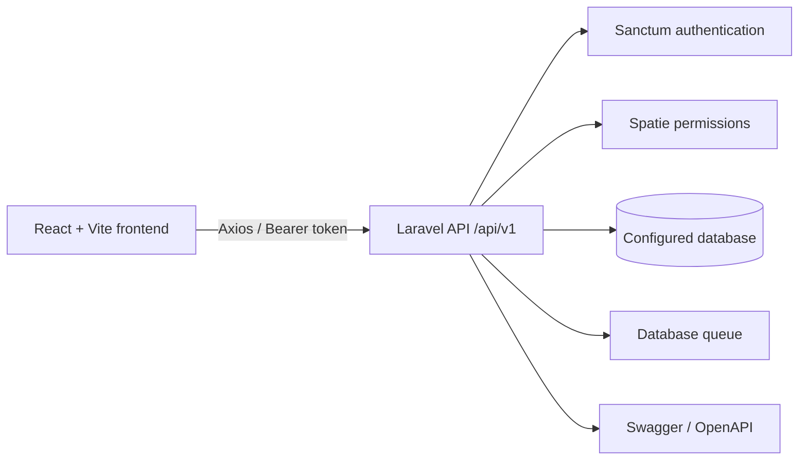

# Clinic System

Full-stack clinic management system for coordinating staff accounts, doctors, patients, appointments, and clinical consultations.

The repository contains two applications:

- **Backend:** Laravel 12 REST API with Sanctum bearer authentication, Spatie roles, database queues, OpenAPI annotations, and PHPUnit.
- **Frontend:** React 19 single-page application built with Vite, React Router, Axios, Tailwind CSS, Lucide icons, and Recharts.

<p align="center">
  <a href="#quick-start">Quick start</a> |
  <a href="#using-the-application">Use the app</a> |
  <a href="#api-reference">API reference</a> |
  <a href="#development-workflow">Development</a>
</p>

## Table Of Contents

- [Overview](#overview)
- [Features](#features)
- [Architecture](#architecture)
- [Requirements](#requirements)
- [Quick Start](#quick-start)
  - [1. Install backend dependencies](#1-install-backend-dependencies)
  - [2. Configure the backend](#2-configure-the-backend)
  - [3. Prepare the database](#3-prepare-the-database)
  - [4. Install frontend dependencies](#4-install-frontend-dependencies)
  - [5. Start both applications](#5-start-both-applications)
- [Using The Application](#using-the-application)
  - [Seeded accounts](#seeded-accounts)
  - [Role permissions](#role-permissions)
  - [Main frontend routes](#main-frontend-routes)
- [API Reference](#api-reference)
  - [Base URLs](#base-urls)
  - [Authentication](#authentication)
  - [Response format](#response-format)
  - [Endpoint summary](#endpoint-summary)
  - [Example API calls](#example-api-calls)
  - [Interactive API documentation](#interactive-api-documentation)
- [Configuration](#configuration)
  - [Backend environment](#backend-environment)
  - [Frontend environment](#frontend-environment)
- [Development Workflow](#development-workflow)
  - [Useful backend commands](#useful-backend-commands)
  - [Useful frontend commands](#useful-frontend-commands)
  - [Testing](#testing)
  - [Code organization](#code-organization)
- [Troubleshooting](#troubleshooting)
- [Security Notes](#security-notes)
- [Contributing](#contributing)
- [License](#license)

## Overview

Clinic System gives clinic staff a single workflow for:

1. Signing in with a role-specific account.
2. Searching and maintaining patient records.
3. Managing doctor profiles and schedules.
4. Booking, confirming, cancelling, and rescheduling appointments.
5. Recording consultations and reviewing patient history.
6. Giving administrators operational statistics and staff management tools.

The API is versioned under `/api/v1`. The frontend communicates with it through Axios and automatically attaches the stored Sanctum token as a bearer token.

## Features

- Role-based access for `admin`, `doctor`, and `receptionist` users.
- Sanctum token authentication with login, current-user, and logout endpoints.
- Patient CRUD operations with receptionist-only writes.
- Doctor profiles and availability lookup.
- Appointment booking, confirmation, cancellation, and rescheduling.
- Doctor-only consultations and patient history.
- Admin-only user management and dashboard statistics.
- Consistent success and error response envelopes.
- OpenAPI/Swagger documentation generated from PHP attributes.
- Importable Postman collection and local environment.
- Database seeders with ready-to-use development accounts.
- Queue-ready appointment notification job infrastructure.

## Architecture



```text
Clinic System/
├── backend/                 Laravel API
│   ├── app/                 Controllers, models, policies, jobs, API docs
│   ├── database/            Migrations, factories, and seeders
│   ├── routes/              Web and versioned API routes
│   ├── tests/               PHPUnit unit and feature tests
│   └── storage/api-docs/    Generated OpenAPI output
├── frontend/                React/Vite client
│   └── src/                 Pages, components, context, hooks, and API modules
└── docs/                    Postman collection and environment
```

## Requirements

- PHP `8.2+`
- Composer
- Node.js and npm
- A database supported by Laravel; SQLite is the simplest local option
- Git
- Optional: Redis, if Redis is selected for cache, queues, or sessions

On Windows, PowerShell commands in this guide assume the repository is located at `E:\Laravel\Clinic System`. Adjust the path if necessary.

## Quick Start

### 1. Install backend dependencies

```powershell
cd "E:\Laravel\Clinic System\backend"
composer install
```

### 2. Configure the backend

Create the local environment file and generate the application key:

```powershell
Copy-Item .env.example .env
php artisan key:generate
```

The default `.env.example` uses SQLite. Create the database file if it does not already exist:

```powershell
New-Item -ItemType File -Path database\database.sqlite -Force
```

For MySQL or PostgreSQL, edit `.env` and set `DB_CONNECTION`, host, port, database, username, and password instead.

### 3. Prepare the database

Run migrations and seed development data:

```powershell
php artisan migrate --seed
```

Clear stale framework caches when switching environments:

```powershell
php artisan optimize:clear
```

### 4. Install frontend dependencies

Open a second PowerShell terminal:

```powershell
cd "E:\Laravel\Clinic System\frontend"
npm install
```

The frontend already includes a local `.env` with:

```env
VITE_API_URL=http://localhost:8000/api/v1
```

Create or update `frontend/.env` if the API runs at another host or port.

### 5. Start both applications

Start the Laravel API:

```powershell
cd "E:\Laravel\Clinic System\backend"
php artisan serve
```

Start the Vite client in the second terminal:

```powershell
cd "E:\Laravel\Clinic System\frontend"
npm run dev
```

Open the URL printed by Vite, normally `http://localhost:5173`. The API is normally available at `http://localhost:8000`.

For a backend-only development session, the Composer `dev` script starts the Laravel server, queue listener, log viewer, and Vite process together:

```powershell
cd "E:\Laravel\Clinic System\backend"
composer run dev
```

Use the separate-terminal workflow when the frontend has its own dependency installation or when individual process logs are easier to inspect.

## Using The Application

### Seeded accounts

All seeded accounts use the password `password` in local development only.

| Role | Email | Password | Primary purpose |
|---|---|---|---|
| Admin | `admin@clinic.test` | `password` | Staff, doctors, and dashboard |
| Doctor | `doctor@clinic.test` | `password` | Consultations and patient history |
| Receptionist | `reception@clinic.test` | `password` | Patients and appointments |

Do not use these credentials outside a local or disposable development database. Change or remove seeded passwords before deploying anywhere shared.

### Role permissions

| Capability | Admin | Doctor | Receptionist |
|---|:---:|:---:|:---:|
| View patients | Yes | Yes | Yes |
| Create, update, delete patients | No | No | Yes |
| View doctors and availability | Yes | Yes | Yes |
| Create or update doctors | Yes | No | No |
| View appointments | Yes | Yes | Yes |
| Create, update, confirm, or cancel appointments | No | No | Yes |
| Create or update consultations | No | Yes | No |
| View patient history | No | Yes | No |
| Manage users | Yes | No | No |
| View admin dashboard | Yes | No | No |

### Main frontend routes

| Route | Access | Purpose |
|---|---|---|
| `/login` | Public | Sign in |
| `/` | Authenticated | Dashboard |
| `/patients` | All staff | Patient list |
| `/patients/new` | Receptionist | Add a patient |
| `/patients/:id/edit` | Receptionist | Edit a patient |
| `/patients/:id/history` | Doctor | View clinical history |
| `/doctors` | All staff | Doctor list |
| `/doctors/new` | Admin | Add a doctor |
| `/doctors/:id/edit` | Admin | Edit a doctor |
| `/appointments` | All staff | Appointment list |
| `/appointments/new` | Receptionist | Book an appointment |
| `/appointments/:id/reschedule` | Receptionist | Reschedule an appointment |
| `/appointments/:appointmentId/consultation/new` | Doctor | Record a consultation |
| `/consultations/:id` | Doctor | View a consultation |
| `/consultations/:id/edit` | Doctor | Edit a consultation |
| `/users` | Admin | Manage staff accounts |

## API Reference

### Base URLs

| Environment | URL |
|---|---|
| Local API | `http://localhost:8000/api/v1` |
| Swagger UI | `http://localhost:8000/api/documentation` |
| OpenAPI JSON | `http://localhost:8000/docs/api-docs.json` |
| Postman base URL | `{{base_url}}` from `docs/Clinic.postman_environment.json` |

The exact Swagger asset route is controlled by `config/l5-swagger.php`; use the Swagger UI link above after starting the backend and regenerate the specification if annotations changed.

### Authentication

Login is public:

```http
POST /api/v1/auth/login
Content-Type: application/json

{
  "email": "doctor@clinic.test",
  "password": "password",
  "device_name": "local-browser"
}
```

Use the returned token on protected requests:

```http
Authorization: Bearer <token>
Accept: application/json
```

The API also provides:

- `GET /api/v1/auth/me` to retrieve the authenticated user.
- `POST /api/v1/auth/logout` to revoke the current token.

### Response format

Successful responses use:

```json
{
  "success": true,
  "message": "Request completed",
  "data": {}
}
```

Errors use:

```json
{
  "success": false,
  "message": "Validation failed",
  "errors": {
    "email": ["The email field is required."]
  }
}
```

Common status codes are `200` for successful reads or updates, `201` for creation, `401` for missing or invalid authentication, `403` for insufficient role access, `404` for missing records, `409` for business-rule conflicts, `422` for validation failures, and `429` for rate limiting.

### Endpoint summary

All endpoints below are relative to `/api/v1`. Unless marked **Public**, they require a Sanctum bearer token.

| Method | Endpoint | Access | Description |
|---|---|---|---|
| `GET` | `/ping` | Public | Health check |
| `POST` | `/auth/login` | Public | Create an API token |
| `GET` | `/auth/me` | Authenticated | Get the current user |
| `POST` | `/auth/logout` | Authenticated | Revoke the current token |
| `GET` | `/users` | Admin | List users |
| `POST` | `/users` | Admin | Create a user |
| `GET` | `/users/{user}` | Admin | Get a user |
| `PUT/PATCH` | `/users/{user}` | Admin | Update a user |
| `DELETE` | `/users/{user}` | Admin | Delete a user |
| `GET` | `/patients` | All staff | List patients |
| `POST` | `/patients` | Receptionist | Create a patient |
| `GET` | `/patients/{patient}` | All staff | Get a patient |
| `PUT` | `/patients/{patient}` | Receptionist | Update a patient |
| `DELETE` | `/patients/{patient}` | Receptionist | Delete a patient |
| `GET` | `/doctors` | All staff | List doctors |
| `POST` | `/doctors` | Admin | Create a doctor |
| `GET` | `/doctors/{doctor}` | All staff | Get a doctor |
| `PUT` | `/doctors/{doctor}` | Admin | Update a doctor |
| `GET` | `/doctors/{doctor}/availability` | All staff | Check available appointment slots |
| `GET` | `/admin/dashboard` | Admin | Get dashboard statistics |
| `GET` | `/appointments` | All staff | List appointments |
| `POST` | `/appointments` | Receptionist | Book an appointment |
| `GET` | `/appointments/{appointment}` | All staff | Get an appointment |
| `PUT` | `/appointments/{appointment}` | Receptionist | Update or reschedule an appointment |
| `POST` | `/appointments/{appointment}/confirm` | Receptionist | Confirm an appointment |
| `POST` | `/appointments/{appointment}/cancel` | Receptionist | Cancel an appointment |
| `POST` | `/appointments/{appointment}/consultation` | Doctor | Create a consultation |
| `GET` | `/consultations/{consultation}` | Doctor | Get a consultation |
| `PUT` | `/consultations/{consultation}` | Doctor | Update a consultation |
| `GET` | `/patients/{patient}/history` | Doctor | Get patient consultation history |

The route file is the source of truth for authorization and current endpoint behavior: `backend/routes/api/v1.php`.

### Example API calls

Check that the API is reachable:

```powershell
curl.exe http://localhost:8000/api/v1/ping
```

Log in and save the token in PowerShell:

```powershell
$login = Invoke-RestMethod `
  -Method Post `
  -Uri "http://localhost:8000/api/v1/auth/login" `
  -ContentType "application/json" `
  -Body '{"email":"doctor@clinic.test","password":"password","device_name":"powershell"}'

$token = $login.data.token
```

Call a protected endpoint:

```powershell
Invoke-RestMethod `
  -Method Get `
  -Uri "http://localhost:8000/api/v1/auth/me" `
  -Headers @{ Authorization = "Bearer $token"; Accept = "application/json" }
```

### Interactive API documentation

1. Start the backend with `php artisan serve`.
2. Open [`http://localhost:8000/api/documentation`](http://localhost:8000/api/documentation).
3. Select **Authorize** in Swagger UI.
4. Enter `Bearer <token>` from the login response.
5. Execute protected operations directly from the browser.

To regenerate the specification after changing OpenAPI attributes:

```powershell
cd "E:\Laravel\Clinic System\backend"
php artisan l5-swagger:generate
```

For repeatable API workflows, import [`docs/Clinic API.postman_collection.json`](docs/Clinic%20API.postman_collection.json) and [`docs/Clinic.postman_environment.json`](docs/Clinic.postman_environment.json) into Postman. The login requests store the token in the active environment automatically.

## Configuration

### Backend environment

The main values in `backend/.env` are:

| Variable | Purpose | Local default |
|---|---|---|
| `APP_URL` | Public backend URL | `http://localhost` |
| `DB_CONNECTION` | Database driver | `sqlite` |
| `DB_DATABASE` | Database path or database name | SQLite file |
| `QUEUE_CONNECTION` | Queue backend | `database` |
| `CACHE_STORE` | Cache backend | `database` |
| `MAIL_MAILER` | Mail transport | `log` |
| `L5_SWAGGER_CONST_HOST` | Server URL shown in OpenAPI | `http://localhost` |

Keep `.env` files and generated keys out of version control. Use `.env.example` as the starting point for new environments.

### Frontend environment

| Variable | Purpose | Example |
|---|---|---|
| `VITE_API_URL` | Axios API base URL | `http://localhost:8000/api/v1` |

Vite exposes variables prefixed with `VITE_` to browser code. Never put passwords, private keys, or server-only secrets in `frontend/.env`.

## Development Workflow

### Useful backend commands

Run these from `backend/`:

```powershell
php artisan route:list
php artisan migrate
php artisan migrate:fresh --seed
php artisan db:seed
php artisan queue:work
php artisan pail
php artisan config:clear
php artisan cache:clear
php artisan optimize:clear
php artisan l5-swagger:generate
```

`migrate:fresh --seed` deletes all local database tables before rebuilding them. Use it only when that data can be discarded.

### Useful frontend commands

Run these from `frontend/`:

```powershell
npm run dev
npm run build
npm run preview
npm run lint
```

The production build is emitted by Vite into `frontend/dist/`.

### Testing

Run the backend test suite:

```powershell
cd "E:\Laravel\Clinic System\backend"
php artisan test
```

Run only one suite or test file:

```powershell
php artisan test --testsuite=Feature
php artisan test tests\Feature\ExampleTest.php
```

Run frontend linting and a production build:

```powershell
cd "E:\Laravel\Clinic System\frontend"
npm run lint
npm run build
```

When adding behavior, cover authorization boundaries, validation failures, successful state transitions, and important API response shapes. The PHPUnit configuration currently uses array/session/mail/queue test services; set an isolated test database explicitly when tests need persistence.

### Code organization

| Area | Location | Responsibility |
|---|---|---|
| API routes | `backend/routes/api/v1.php` | Versioned endpoint and role middleware declarations |
| Controllers | `backend/app/Http/Controllers/Api/V1` | Request orchestration |
| Form requests | `backend/app/Http/Requests` | Input validation and authorization checks |
| Models | `backend/app/Models` | Eloquent persistence and relationships |
| Policies | `backend/app/Policies` | Record-level authorization |
| Resources | `backend/app/Http/Resources` | Stable JSON representations |
| Jobs | `backend/app/Jobs` | Deferred work such as notifications |
| OpenAPI docs | `backend/app/Docs` | PHP attribute-based API documentation |
| React pages | `frontend/src/pages` | Route-level screens |
| React components | `frontend/src/components` | Reusable UI and layout pieces |
| API modules | `frontend/src/api` and `frontend/src/lib` | HTTP calls and shared Axios behavior |
| Auth state | `frontend/src/context` | Login session and current-user state |

## Troubleshooting

<details>
<summary>Frontend says it cannot reach the server</summary>

Confirm that `php artisan serve` is running and that `frontend/.env` points to the same API host and port:

```env
VITE_API_URL=http://localhost:8000/api/v1
```

Restart Vite after changing environment variables because Vite reads them when the dev server starts.
</details>

<details>
<summary>Login returns 401</summary>

Run `php artisan migrate --seed` and use one of the seeded emails and the local password `password`. A 401 can also mean the token has expired or was revoked; log in again.
</details>

<details>
<summary>Login returns 429</summary>

The login route is rate limited. Wait for the `Retry-After` period before trying again, and avoid automated repeated login attempts during development.
</details>

<details>
<summary>Database or session tables are missing</summary>

Run:

```powershell
php artisan migrate
```

For a disposable local database with seed data:

```powershell
php artisan migrate:fresh --seed
```
</details>

<details>
<summary>Swagger does not show recent endpoints</summary>

Regenerate the OpenAPI files and clear Laravel caches:

```powershell
php artisan l5-swagger:generate
php artisan optimize:clear
```
</details>

<details>
<summary>Appointment notifications or queued work are not running</summary>

The default queue connection is `database`. Ensure migrations have run and start a worker:

```powershell
php artisan queue:work
```

For local debugging, `composer run dev` starts a queue listener automatically.
</details>

<details>
<summary>Port 8000 or 5173 is already in use</summary>

Start Laravel on another port:

```powershell
php artisan serve --port=8001
```

Then update `VITE_API_URL` to `http://localhost:8001/api/v1` and start Vite on another port if needed:

```powershell
npm run dev -- --port 5174
```
</details>

## Security Notes

- Use HTTPS for any non-local deployment.
- Replace all seeded passwords before exposing the application.
- Keep `APP_DEBUG=false` in production.
- Never commit `.env`, API tokens, database credentials, or generated application keys.
- Use a least-privilege database account and a separate database for tests.
- Protect Swagger UI or disable public access in deployments where the API contract must remain private.
- Review CORS, trusted hosts, session settings, mail transport, queue workers, and log retention before production launch.
- Do not log bearer tokens or sensitive clinical information.
- Treat consultation and patient-history data as sensitive health information and apply the retention and access controls required by the deployment environment.

## Contributing

1. Create a focused branch for the change.
2. Keep API behavior, validation, resources, and frontend consumers aligned.
3. Add or update tests for changed behavior and role boundaries.
4. Run `php artisan test`, `npm run lint`, and `npm run build` before opening a pull request.
5. Regenerate Swagger documentation when API annotations change.
6. Do not include local `.env` files, generated secrets, or disposable database files in commits.

## License

This project currently follows the MIT license declared by the Laravel application package. Confirm the intended product-level license before publishing or distributing the complete system.